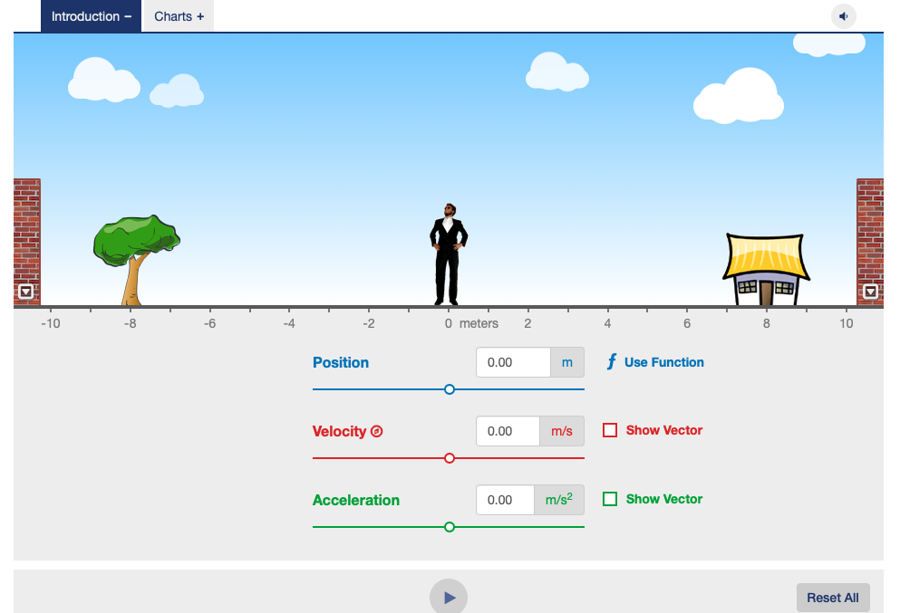
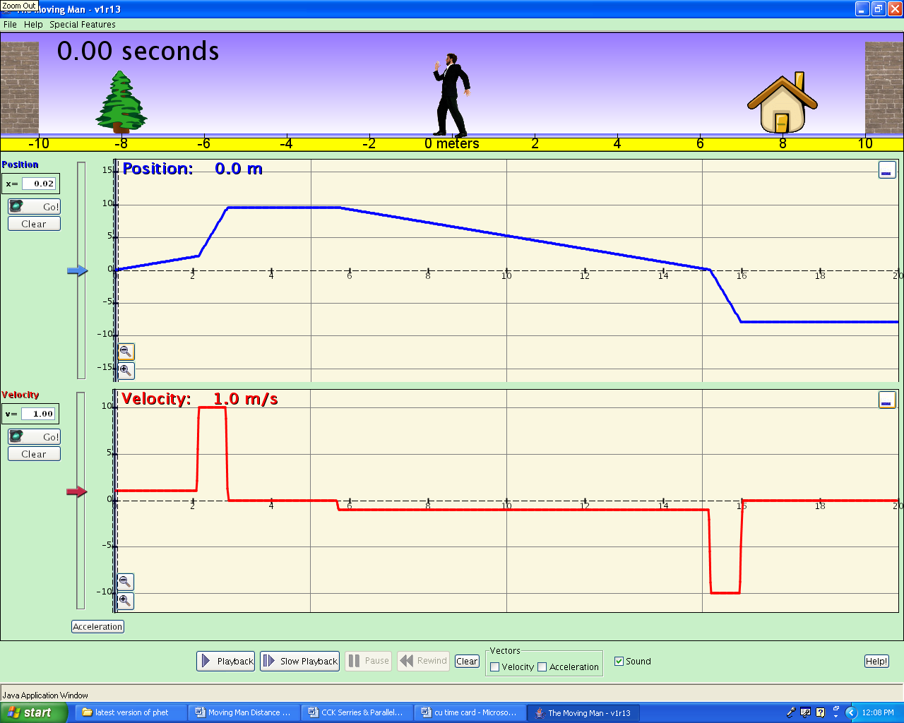

**University Physics I-PHY 161**

Active Learning Activity Guide #1-Position

*Slow and steady wins the race.*

Aesop\'s fable: The Hare and the Tortoise

In this ALAG you will examine two different ways that the motion of an
object can be represented graphically. You will use a motion detector to
plot distance (position) and velocity-time graphs of the motion of your
own body and a cart. The study of motion and its mathematical and
graphical representation is known as *kinematics.* All work for the unit
will be recorded in this unit packet with will be included in your
activity notebook along with any video and class notes for grading.

SECTION 1: Position-Time Graphs of Your Motion

The purpose of this section is to learn how to relate graphs of the
position as a function of time to the motions they represent.

You will need the following materials:

• *Graphical Analysis* software

• Motion detector

• Number line on floor in meters (optional)

The questions we're going to look at include: How does the position-time
graph look when you move slowly? Quickly? What happens when you move
toward the motion detector? Away? After completing this section, you
should be able to look at a position-time graph and describe the motion
of an object. You should also be able to look at the motion of an object
and sketch a graph representing that motion.

**Comment:** \"Position\" is short for \"distance from the motion
detector.\" The motion detector is the origin from which distances are
measured:

• It detects the closest object directly in front of it .

• It will not correctly measure anything closer than 15 centimeters.

• The graph on the screen displays how far away from the detector you
are.

Activity 1.1: Making Distance-Time Graph

For this exercise you will need the following:

• *Graphical Analysis Software Package*

• Go Direct Motion Detector

• Reflection Board

1\. Turn on the GoDirect Motion Detector by pressing the power button on
the front of the sensor for a few seconds. The red light to the right of
the power button with the Bluetooth symbol over it should flash red
about once per second. Now, on your computer, open Graphical Analysis.
Select Sensor Data Collection from the Opening Menu. This will open the
sensor connection dialog screen. Under the "Discovered Wireless Devices"
heading you should see one or more Bluetooth sensors listed. You
specifically want to look at those that begin with GDX-MD. Next to that
tag, you'll see a serial number. Check to see the series number on the
front of your GoDirect Motion Detector and then click Connect on the
dialog box for that force probe and then click "Done".

A single position vs. time graph or force graph should automatically
load onto the screen. There will be a collect button at the top of the
window.

3\. When you are ready to start graphing position, click once on the
**Collect** \"button\" at the top of the graph window.

4\. For the first portion of this activity we will study constant
position motion. For the following two cases perform the described
"motion and then draw what appears on the screen. If there is more than
one plot or "curve" on a graph, be sure to label each curve clearly.
Perform the following motions in front of the motion detector while
Graphical Analysis is taking data and then record the results in your
activity notebook on a set of sketched axes like one the ones below.

Perform the motion that gives a constant position curve at 70 cm for 5
sec.

Perform the motion that gives a constant position curve at 180 cm for 5
sec.

> {width="5.652956036745407in"
> height="3.20792104111986in"}

What motion was performed to obtain part a? What motion was performed to
obtain part b?

Are these motions related? If so, in what way are they related?

Is it possible for the motion detector to record a position of zero?
What about a negative position? Take a few moments to consider and
experiment with this. Explain your responses using the observations you
have made.

6\. Make position-time graphs for different walking speeds and
directions, and sketch your graphs iin your activity notebook.
Additionally, describe in some detail what you did to produce each
graph.

  ------------------------------------------------------------------------------------------------
  a\. Start at the 1/2-meter mark and {width="2.888888888888889in"
  away from the detector (origin)     height="1.6395833333333334in"}
  *slowly and steadily*.              
  ----------------------------------- ------------------------------------------------------------
  b\. Make a position-time graph,     {width="2.888888888888889in"
  (origin) *medium fast and           height="1.6395833333333334in"}
  steadily*.                          

  c\. Make a position-time graph,     {width="2.888888888888889in"
  (origin) *slowly and steadily*.     height="1.6395833333333334in"}

  d\. Make a position-time graph,     {width="2.888888888888889in"
  (origin) *medium fast and           height="1.6395833333333334in"}
  steadily*.                          
  ------------------------------------------------------------------------------------------------

Describe the difference between the line made on the graph when you
walked away *slowly* and the one made by walking away *more quickly*.

What quantity is different for the line on the graphs when you walk at a
different rate?

Describe the difference between the line made on the graph when you
walked *toward* the motion detector and the one made walking *away from*
the motion detector.

How does this relate to your answer in question b?

**Comment:** It is common to refer to the distance of an object from
some origin as the *position* of the object. Since the motion detector
is at the origin of the coordinate system, it is better to refer to the
graphs you have made as *position-time* graphs. From now on you will
plot *position-time* graphs.

6\. Predict the position-time graph produced when a person starts at the
1-meter mark, walks away from the detector slowly and steadily for 5
seconds, stops for 5 seconds, and then walks toward the detector quickly
for 2 seconds. Sketch your prediction in your activity notebook using a
dashed line. Compare predictions with the rest of your group. See if you
all can agree. Draw your group\'s prediction on your prediction graph
using a solid line. (Do not erase your original prediction.)

PREDICTION FINAL RESULT

{width="2.5812839020122484in"
height="1.465003280839895in"}{width="2.6732666229221347in"
height="1.5172069116360456in"}

7\. Test your prediction. You will need to reset your time axis. You can
do this by clicking on Mode button at the bottom of the graph window.
Change the time in the "End Collection" window from 5 to 15 seconds.
Move in the way described above and graph your motion. When you are
satisfied with your graph, draw your group\'s final result on the right
axes above.

Is your prediction the same as the final result? If not, describe how
you would move to make a graph that looks like your *prediction.*

Activity 1.2: Matching a Position Graph

By now you should be pretty good at predicting the shape of a graph of
your movements. Can you do things the other way around by reading a
position-time graph and figuring out how to move to reproduce it? In
this activity you will match a position graph shown on the computer
screen.

1\. On your position-time graph, click on the button in the lower
left-hand portion of the window that looks like a small graph known as
the "Graph Tools" menu. This will open a menu-select **Add Prediction**
from this menu. Use your mouse or trackpad to draw the line shown on the
position-time graph below as closely as you can. You can name this line
"Position Match" in the title box in the upper left-hand corner of the
window.

{width="5.082764654418198in"
height="1.998500656167979in"}

**Comment:** This graph is stored in the computer. New data from the
motion detector are always stored as a new run and can therefore be
collected without erasing the **Position Match** graph.

2\. Move to match the **Position Match** graph on the computer screen.
You may try a number of times. It helps to work in a team. Get the times
right. Get the positions right. **Each person should take a turn.**

Assessment-*Student Dialogue:* Read the following statements below
regarding a conversation between two students who have just done the
position match graph activity you just worked on and then answer the
questions to the best of your ability. Note, the question is designed so
that at least one of the students is dealing with a fundamental
misconception about the activity you and your group have just done.
Don't be afraid to identify and correct that misconception.

*Student #1:* The graphs tell you what the person actually did. In the
position match graph the flat sections were the person moving away (to
the right) at a constant rate and the upwards sloping sections were a
when the person sped up.

*Student #2:* I disagree. The x-axis on the graph is a time axis, not a
distance axis. In the flat sections, the person stood still for a
certain amount of time. The

sloped sections were when the person actually moved. The steeper the
slope, the faster the person moved away from the motion detector.

Which student or students do you agree with and why?

What data do you have from Activity 1.1 do you have to support your
conclusion?

**SECTION 2 - Using the Moving Man Simulation to Understand Position
Time Graphs**

**Background --** This activity will build off of the work you have
already done for Activity 1 and then ask you to extend that a bit. In
this ALAG, the key idea is to begin to understand how things that happen
in the real world such as someone moving in space can be represented
graphically. This requires that we learn to read and understand graphs
that are based on physical quantities as an extension of what you
learned about graphs in your math classes.

**Learning Goals** -- The students will:

-   Develop a general knowledge of distance time graphs.

    -   What a graph of a person standing still would look like

    -   What a graph of a person moving away from an observer would look
        like.

    -   What a graph of a person moving towards an observer would look
        like.

    -   How differences in speed appear on the graph

{width="3.5555555555555554in"
height="2.41875in"}**Procedure --** We will do this ALAG using a
simulation titled "Moving Man" that can be accessed using the link found
in the assignment page for this ALAG in Canvas. Click on the link found
there to open the simulation and follow the directions as follows.

**Getting started.** At the top of the simulation page select the tab
that is labeled charts.

1.  After "Moving Man" is open leave the position graph open but close
    all of the other graphs, velocity and acceleration. You can do this
    by clicking on the arrow boxes in the upper right-hand corners of
    the velocity and acceleration graphs. Your screen should look like
    screen 1.

2.  **Learning to Use the Simulation.** By either clicking on the man or
    the slider next to the vertical axis on the graph, cause the man to
    move back and forth and observe what shows up on the graph. To make
    a line on the graph, you will have to click the play/record button
    at the bottom of the simulation. Play around with this a bit without
    recording anything in this ALAG. The goal with this is to get a
    sense of how things work in the simulation environment. Notice that
    in the simulation, the origin is at the middle of the screen and
    that positions to the left are negative. This is a bit different
    than what we saw in ALAG #1 with the motion detector. In your
    activity notebook, discuss why you think that is and what positive
    and negative values of position mean in the simulation.

3.  **Making Observations.** What we wish to do now is a series of
    guided investigations that will formalize what was discovered by
    playing with the simulation. Using the axes provided on the next two
    pages as a guide make a sketch of the graph that is produced by each
    action described in your activity notebook.

**\
**

4.  **Apply what you learned.** Look at the graph below and for the
    different parts of the graph that are marked write a statement in
    the blank space in the table that follows about what is happening.
    Be sure to include the direction of motion (right, left, forwards,
    backwards, etc) and the speed of motion.

{width="7.125in" height="2.25in"}

+------+---------------------------------------------------------------+
| Part | Description of direction and speed                            |
+======+===============================================================+
| A.   |                                                               |
+------+---------------------------------------------------------------+
| B.   |                                                               |
+------+---------------------------------------------------------------+
| C.   |                                                               |
+------+---------------------------------------------------------------+
| D.   |                                                               |
+------+---------------------------------------------------------------+
| E.   |                                                               |
+------+---------------------------------------------------------------+
| F.   |                                                               |
+------+---------------------------------------------------------------+

5.  **Distilling What You've Learned.** Answer the following questions.
    You may need to do some additional investigations with the
    simulation to answer the questions.

    a.  What does a horizontal line on the position-time graph mean
        physically?

    b.  How is the speed of the moving man's motion represented on a
        position-time graph?

    c.  How is the direction of the moving man's motion represented on
        the position-time graph?

    d.  What did a negative value on the position-time graph mean
        physically?

6.  **Making Connections**

    a.  What does the slope of the line on the position-time graph tell
        you about the motion of the man?

    b.  From the reading in your text, what is the name we give this
        quantity?

    c.  How does this quantity differ from "speed"?
